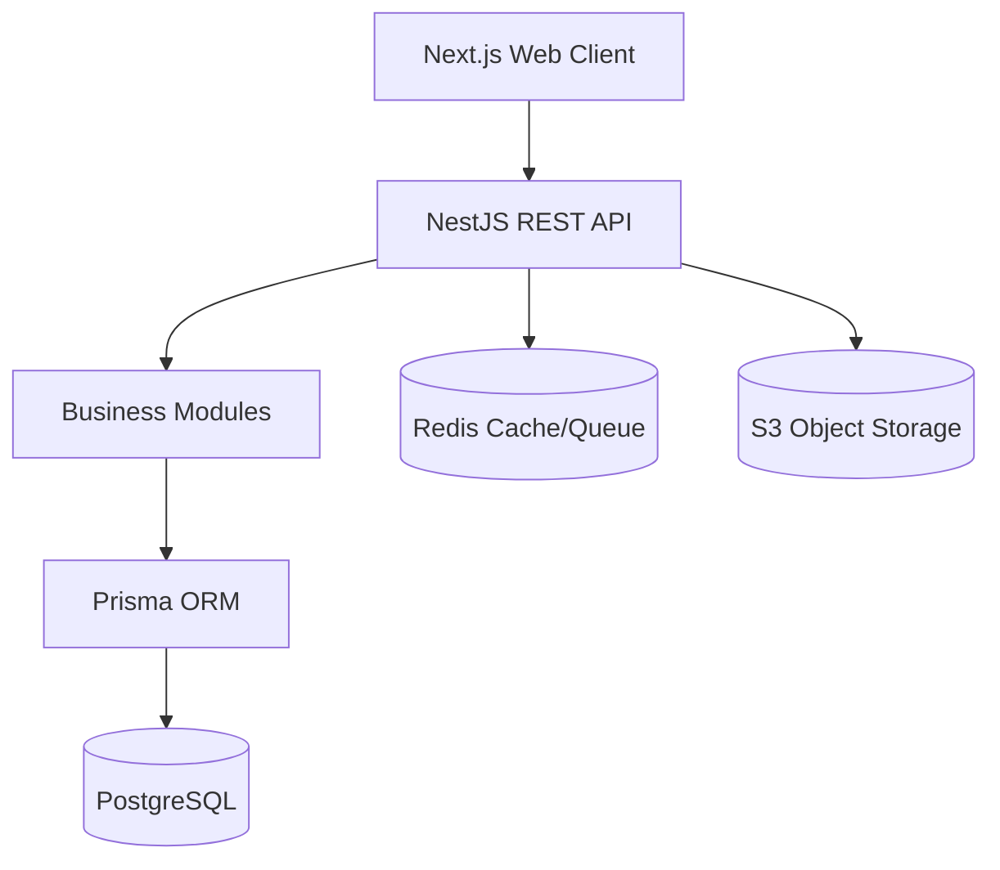

# DOC-04: System Architecture Document (SAD)

**Version:** 1.0 | **Status:** APPROVED | **Date:** 2026-08-27
**Purpose:** Define the high-level system architecture and constraints.
**Owner:** Senior Software Architect

## Architecture Overview

- **Pattern:** Modular Monolith + API-first.
- **Frontend:** Next.js, React, TypeScript, Tailwind CSS, shadcn/ui, TanStack Query.
- **Backend:** NestJS, Node.js, TypeScript.
- **Database:** PostgreSQL with Prisma ORM.

## Logical Architecture

- **Clients:** Next.js Web (Future: Flutter).
- **API Gateway/Layer:** REST API via NestJS.
- **Infrastructure Services:** Redis (for rate limiting, queues, session data), S3-compatible Object Storage.

## Architectural Principles & Rules

1. TypeScript everywhere.
2. Modular Monolith. No premature microservices.
3. Multi-tenant by design. Application-level tenant isolation.
4. Backend is the source of truth for authorization.
5. Controllers remain thin; Services contain business logic.
6. DTO validation is mandatory.

