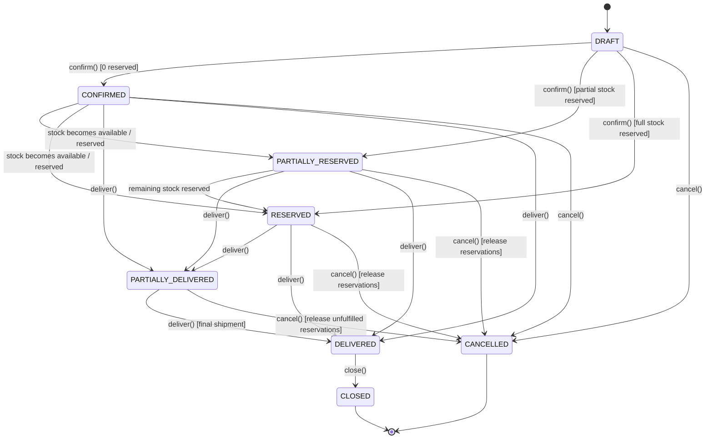

# ADR-017: Sales Order State Machine and Lifecycle Transitions

## Status

Accepted

## Context

A sales order represents a binding commercial commitment between a tenant and a customer. Unlike informal inquiries or draft quotes, a sales order interacts with physical warehouse stock, inventory reservations, and delivery fulfillment. We require a deterministic finite state machine (FSM) to prevent invalid transitions (e.g. delivering an unconfirmed order, updating lines of a confirmed order, or cancelling a delivered order).

## Decision

We implement an explicit Sales Order Finite State Machine with the following state transitions:

### Transition Invariants

1. **DRAFT**: Financial lines and shipping totals may be modified. No stock is reserved.
2. **CONFIRMED / PARTIALLY_RESERVED / RESERVED**: Order lines are locked. Inventory reservations are created based on available on-hand stock.
3. **PARTIALLY_DELIVERED / DELIVERED**: Triggered upon completion of delivery orders. Delivers physical stock via `BalancesService` (`StockMovementType.ISSUE`).
4. **CANCELLED**: Releases all active `InventoryReservation` records and decrements `InventoryBalance.quantityReserved`. Cannot cancel once fully `DELIVERED` or `CLOSED`.
5. **CLOSED**: Terminal state for fully fulfilled orders.

## Consequences

- **Positive**: Strict financial and warehouse consistency; prevents inventory leakage and over-commitment.
- **Negative**: Edits to quantities require cancelling and recreating orders once confirmed.
