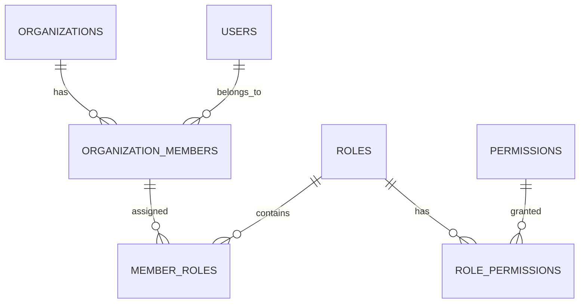

# DOC-05: Database Design Document

**Version:** 1.0 | **Status:** APPROVED | **Date:** 2026-08-27
**Purpose:** Conceptual and logical database architecture.
**Owner:** Database Architect

## Database Principles

- **Naming Convention:** `snake_case` + plural for tables (e.g., `organizations`, `users`).
- **Primary Keys:** UUID `id` for all tables.
- **Timestamps:** `created_at`, `updated_at`, `deleted_at` (nullable).
- **Soft Delete:** Evaluated entity-by-entity (e.g., `users`, `organizations`), not blindly applied.
- **Tenant Isolation:** `organization_id` in all tenant-owned tables. Composite indexes on `(organization_id, created_at)`.

## Core Entities

1. **organizations:** `id`, `name`, `slug`, `status`.
2. **users:** `id`, `email`, `password_hash`, `status`.
3. **organization_members:** `id`, `organization_id`, `user_id`, `status`.
4. **roles & permissions:** `roles`, `permissions`, `role_permissions`, `member_roles`.
5. **audit_logs:** `id`, `organization_id`, `actor_user_id`, `action`, `resource`, `metadata`.

