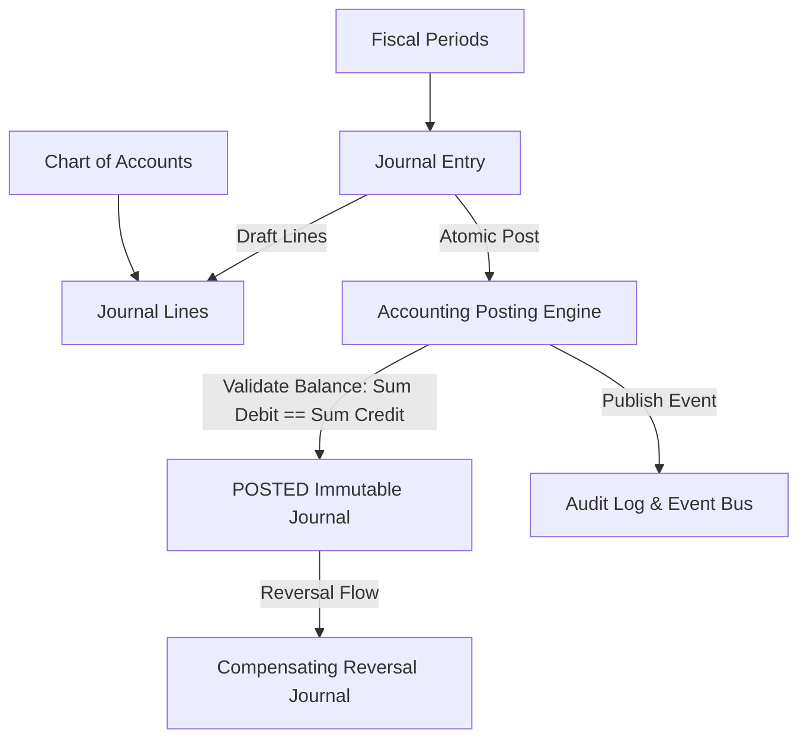

# Milestone M12: Accounting & Finance Foundation

## 1. Overview & Architectural Scope

Milestone M12 establishes the multi-tenant general ledger and double-entry accounting engine for the **Universal Business Operations SaaS** platform. It provides the foundation for future financial modules, including Accounts Payable, Accounts Receivable, Invoicing, Payments, Inventory Valuation, and Financial Reporting.

---

## 2. Core Entities & Database Schema

### 2.1 Chart of Accounts

- **`Account`**: Multi-tenant chart of accounts with hierarchical parent-child relationships, categorization by `AccountType` (`ASSET`, `LIABILITY`, `EQUITY`, `REVENUE`, `EXPENSE`), system account protection, and tenant isolation.
- **Constraints**:
  - `organization_id + code UNIQUE`
  - `id != parent_id` (no self-parenting)
  - Parent account must belong to the same organization.

### 2.2 Fiscal Periods & Period Locking

- **`FiscalPeriod`**: Accounting time periods (`OPEN`, `CLOSED`).
- **Constraints**:
  - `start_date < end_date`
  - Overlap prevention within the same organization.
  - Irreversible `CLOSED` status preventing subsequent journal postings.

### 2.3 Journal Entries & Double-Entry Bookkeeping

- **`JournalEntry`**: Header record tracking transaction date, fiscal period link, status (`DRAFT`, `POSTED`, `VOIDED`), source reference (`source_type`, `source_id`), and auto-generated sequence number `JE-000001`.
- **`JournalLine`**: Transaction debit and credit lines using PostgreSQL `DECIMAL(20, 4)`.
- **Constraints**:
  - `debit >= 0` AND `credit >= 0`
  - `(debit > 0 AND credit = 0) OR (credit > 0 AND debit = 0)` (XOR constraint)
  - Minimum 2 lines required for posting.
  - Immutability enforced after transition to `POSTED`.

---

## 3. RBAC Permissions Matrix

| Domain Module  | Permission Key                | Description                                        |
| :------------- | :---------------------------- | :------------------------------------------------- |
| Accounts       | `accounting.accounts.view`    | View Chart of Accounts and general ledger accounts |
| Accounts       | `accounting.accounts.manage`  | Create, update, and soft-delete accounts           |
| Fiscal Periods | `accounting.periods.view`     | View fiscal periods and lock status                |
| Fiscal Periods | `accounting.periods.manage`   | Create and manage fiscal periods                   |
| Fiscal Periods | `accounting.periods.close`    | Permanently lock/close fiscal periods              |
| Journals       | `accounting.journals.view`    | View journal entries and line details              |
| Journals       | `accounting.journals.manage`  | Create, update, and delete draft journal entries   |
| Posting Engine | `accounting.journals.post`    | Validate and post balanced journal entries         |
| Reversals      | `accounting.journals.reverse` | Create compensating reversal journal entries       |

---

## 4. API Endpoints

### 4.1 Chart of Accounts

- `POST /api/v1/accounting/accounts` — Create account
- `GET /api/v1/accounting/accounts` — List accounts (hierarchy, search, pagination)
- `GET /api/v1/accounting/accounts/:id` — Get account details with children
- `PATCH /api/v1/accounting/accounts/:id` — Update account
- `DELETE /api/v1/accounting/accounts/:id` — Soft-delete account

### 4.2 Fiscal Periods

- `POST /api/v1/accounting/fiscal-periods` — Create fiscal period
- `GET /api/v1/accounting/fiscal-periods` — List fiscal periods
- `GET /api/v1/accounting/fiscal-periods/:id` — Get fiscal period details
- `POST /api/v1/accounting/fiscal-periods/:id/close` — Lock/close fiscal period

### 4.3 Journals & Posting Engine

- `POST /api/v1/accounting/journals` — Create draft journal entry
- `GET /api/v1/accounting/journals` — List journal entries
- `GET /api/v1/accounting/journals/:id` — Get journal entry with lines
- `PATCH /api/v1/accounting/journals/:id` — Update draft journal entry
- `DELETE /api/v1/accounting/journals/:id` — Delete draft journal entry
- `POST /api/v1/accounting/journals/:id/post` — Post journal entry to general ledger
- `POST /api/v1/accounting/journals/:id/reverse` — Create compensating reversal journal entry
