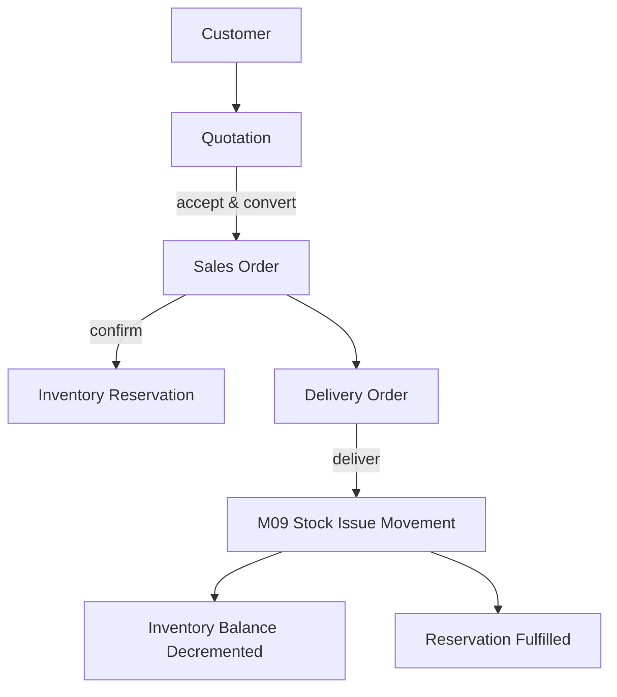

# Milestone M11: Customers & Sales Order Management

## 1. Overview & Architectural Scope

Milestone M11 establishes the production-grade, multi-tenant customer and sales order management foundation for the **Universal Business Operations SaaS** platform. It provides the customer master, tiered pricing rules, quotation-to-order lifecycles, atomic inventory reservations, and delivery fulfillment with automated inventory decrementing.

---

## 2. Core Entities & Database Schema

### 2.1 Customer Master Data

- **`CustomerGroup`**: Segment customers for reporting and tier-pricing (e.g. `WHOLESALE`, `RETAIL`, `VIP`).
- **`Customer`**: Multi-tenant customer profiles with currency, payment terms days, and credit limits.
- **`CustomerContact`**: Multiple customer representatives with primary flags.
- **`CustomerAddress`**: Categorized addresses (`BILLING`, `SHIPPING`, `HEADQUARTERS`, `WAREHOUSE`, `OTHER`) with primary flags per type.

### 2.2 Customer Pricing Foundation

- **`CustomerPrice`**: Rule-based pricing overrides targeting either a specific customer OR customer group (XOR check), and either a base item OR item variant (XOR check), with volume breaks (`minQuantity`) and time validity windows (`validFrom`, `validUntil`).

### 2.3 Quotation Workflow

- **`Quotation` & `QuotationLine`**: Draft-to-accept quotes with auto-numbering (`QT-000001`), tax/discount calculation, and atomic one-click conversion into sales orders (`ACCEPTED` $\to$ `CONVERTED`).

### 2.4 Sales Order & Inventory Reservation

- **`SalesOrder` & `SalesOrderLine`**: Sales contracts tracking order lines, total monetary amounts (`DECIMAL(18, 4)`), reserved quantities, and delivered quantities.
- **`InventoryReservation`**: Hard inventory reservations created during order confirmation to prevent over-selling available physical stock ($\text{Available} = \text{OnHand} - \text{Reserved}$).

### 2.5 Delivery Orders

- **`DeliveryOrder` & `DeliveryOrderLine`**: Outbound shipments fulfilling sales orders, integrating with M09 `BalancesService.applyStockMovement` (`StockMovementType.ISSUE`), tracking batches/serials, and fulfilling reservations.

---

## 3. RBAC Permissions Matrix

| Domain Module    | Permission Key                  | Description                                          |
| :--------------- | :------------------------------ | :--------------------------------------------------- |
| Customer Groups  | `sales.customer-groups.view`    | View customer groups                                 |
| Customer Groups  | `sales.customer-groups.manage`  | Create, update, soft-delete customer groups          |
| Customers        | `sales.customers.view`          | View customer master data, contacts, and addresses   |
| Customers        | `sales.customers.manage`        | Create, update, soft-delete customer profiles        |
| Customer Pricing | `sales.customer-pricing.view`   | View customer price rules                            |
| Customer Pricing | `sales.customer-pricing.manage` | Create, update, delete customer price rules          |
| Quotations       | `sales.quotations.view`         | View quotations and lines                            |
| Quotations       | `sales.quotations.manage`       | Create, update, and convert quotations               |
| Quotations       | `sales.quotations.send`         | Send quotations to customers                         |
| Quotations       | `sales.quotations.accept`       | Mark quotations as accepted                          |
| Quotations       | `sales.quotations.reject`       | Mark quotations as rejected                          |
| Quotations       | `sales.quotations.cancel`       | Cancel draft/sent quotations                         |
| Sales Orders     | `sales.orders.view`             | View sales orders and lines                          |
| Sales Orders     | `sales.orders.manage`           | Create and update draft sales orders                 |
| Sales Orders     | `sales.orders.confirm`          | Confirm sales order & trigger stock reservation      |
| Sales Orders     | `sales.orders.cancel`           | Cancel sales order & release stock reservation       |
| Sales Orders     | `sales.orders.close`            | Close fully delivered sales order                    |
| Reservations     | `sales.reservations.view`       | View inventory reservations                          |
| Reservations     | `sales.reservations.release`    | Manually release active inventory reservations       |
| Delivery Orders  | `sales.deliveries.view`         | View delivery orders                                 |
| Delivery Orders  | `sales.deliveries.manage`       | Create and update draft delivery orders              |
| Delivery Orders  | `sales.deliveries.pick`         | Mark delivery order as picked                        |
| Delivery Orders  | `sales.deliveries.ship`         | Mark delivery order as shipped                       |
| Delivery Orders  | `sales.deliveries.deliver`      | Deliver order, issue stock, and fulfill reservations |
| Delivery Orders  | `sales.deliveries.cancel`       | Cancel delivery orders                               |

---

## 4. API Endpoints

### 4.1 Customer Groups & Customers

- `POST /api/v1/customer-groups` — Create customer group
- `GET /api/v1/customer-groups` — List customer groups
- `GET /api/v1/customer-groups/:id` — Get customer group
- `PATCH /api/v1/customer-groups/:id` — Update customer group
- `DELETE /api/v1/customer-groups/:id` — Soft-delete customer group
- `POST /api/v1/customers` — Create customer
- `GET /api/v1/customers` — List customers (pagination, search, filters)
- `GET /api/v1/customers/:id` — Get customer details
- `PATCH /api/v1/customers/:id` — Update customer
- `DELETE /api/v1/customers/:id` — Soft delete customer
- `POST /api/v1/customers/:customerId/contacts` — Add contact
- `GET /api/v1/customers/:customerId/contacts` — List contacts
- `PATCH /api/v1/customers/:customerId/contacts/:contactId` — Update contact
- `DELETE /api/v1/customers/:customerId/contacts/:contactId` — Delete contact
- `POST /api/v1/customers/:customerId/addresses` — Add address
- `GET /api/v1/customers/:customerId/addresses` — List addresses
- `PATCH /api/v1/customers/:customerId/addresses/:addressId` — Update address
- `DELETE /api/v1/customers/:customerId/addresses/:addressId` — Delete address

### 4.2 Customer Pricing

- `POST /api/v1/customer-prices` — Create pricing override rule
- `GET /api/v1/customer-prices` — List pricing override rules
- `GET /api/v1/customer-prices/:id` — Get price rule
- `PATCH /api/v1/customer-prices/:id` — Update price rule
- `DELETE /api/v1/customer-prices/:id` — Delete price rule

### 4.3 Quotations

- `POST /api/v1/quotations` — Create draft quotation
- `GET /api/v1/quotations` — List quotations
- `GET /api/v1/quotations/:id` — Get quotation details
- `PATCH /api/v1/quotations/:id` — Update draft quotation
- `POST /api/v1/quotations/:id/send` — Send quotation (`DRAFT` $\to$ `SENT`)
- `POST /api/v1/quotations/:id/accept` — Accept quotation (`SENT` $\to$ `ACCEPTED`)
- `POST /api/v1/quotations/:id/reject` — Reject quotation (`SENT` $\to$ `REJECTED`)
- `POST /api/v1/quotations/:id/cancel` — Cancel quotation (`DRAFT`/`SENT` $\to$ `CANCELLED`)
- `POST /api/v1/quotations/:id/convert` — Convert accepted quote to Sales Order (`ACCEPTED` $\to$ `CONVERTED`)

### 4.4 Sales Orders & Reservations

- `POST /api/v1/sales-orders` — Create draft sales order
- `GET /api/v1/sales-orders` — List sales orders
- `GET /api/v1/sales-orders/:id` — Get sales order details
- `PATCH /api/v1/sales-orders/:id` — Update draft sales order
- `POST /api/v1/sales-orders/:id/confirm` — Confirm sales order & reserve available inventory
- `POST /api/v1/sales-orders/:id/cancel` — Cancel sales order & release reservations
- `POST /api/v1/sales-orders/:id/close` — Close delivered sales order
- `GET /api/v1/inventory-reservations` — List inventory reservations
- `GET /api/v1/inventory-reservations/:id` — Get reservation details
- `POST /api/v1/inventory-reservations/:id/release` — Release reservation

### 4.5 Delivery Orders

- `POST /api/v1/delivery-orders` — Create draft delivery order
- `GET /api/v1/delivery-orders` — List delivery orders
- `GET /api/v1/delivery-orders/:id` — Get delivery order details
- `PATCH /api/v1/delivery-orders/:id` — Update draft delivery order
- `POST /api/v1/delivery-orders/:id/pick` — Mark delivery order as picked
- `POST /api/v1/delivery-orders/:id/ship` — Mark delivery order as shipped
- `POST /api/v1/delivery-orders/:id/deliver` — Post delivery, issue stock movements, and fulfill reservations
- `POST /api/v1/delivery-orders/:id/cancel` — Cancel delivery order
