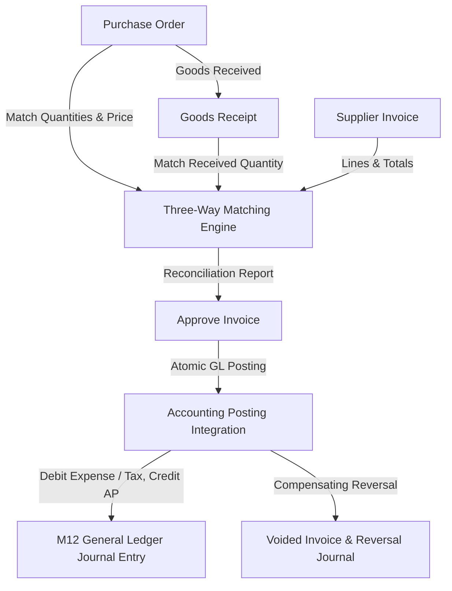

# Milestone M13: Accounts Payable & Supplier Invoicing

## 1. Overview & Architectural Scope

Milestone M13 establishes the production-grade, tenant-aware **Accounts Payable (AP) & Supplier Invoicing** foundation for the **Universal Business Operations SaaS** platform. It seamlessly links procurement workflows (M10 Purchasing, M09 Inventory) with the General Ledger (M12 Accounting).



---

## 2. Core Entities & Database Schema

### 2.1 Supplier Invoices (`SupplierInvoice`)

- **Fields**: `id`, `organization_id`, `supplier_id`, `invoice_number`, `invoice_date`, `due_date`, `currency_id`, `status`, `subtotal`, `discount_amount`, `tax_amount`, `grand_total`, `amount_paid`, `amount_due`, `purchase_order_id`, `goods_receipt_id`, `notes`, `source_reference`, `created_by_user_id`, `posted_by_user_id`, `posted_at`, timestamps.
- **Constraints**:
  - `UNIQUE(organization_id, invoice_number)`
  - `grand_total >= 0`, `amount_paid >= 0`, `amount_due >= 0`
  - `amount_due = grand_total - amount_paid`

### 2.2 Supplier Invoice Lines (`SupplierInvoiceLine`)

- **Fields**: `id`, `supplier_invoice_id`, `organization_id`, `item_id`, `variant_id`, `description`, `quantity`, `unit_price`, `discount_amount`, `tax_rate`, `tax_amount`, `line_total`, `purchase_order_line_id`, `goods_receipt_line_id`, timestamps.
- **Constraints**:
  - `quantity > 0`
  - `unit_price >= 0`, `discount_amount >= 0`, `tax_amount >= 0`, `line_total >= 0`

### 2.3 Accounts Payable Account Mapping (`AccountingAccountMapping`)

- Multi-tenant general ledger mapping configuration storing account mappings for:
  - `ACCOUNTS_PAYABLE` (Liability)
  - `PURCHASE_EXPENSE` (Expense)
  - `INVENTORY_ASSET` (Asset)
  - `INPUT_TAX` (Asset/Liability)
  - `PURCHASE_DISCOUNT` (Expense reduction)
- **Constraints**:
  - `UNIQUE(organization_id, key)`

---

## 3. Invoice State Machine & Lifecycle

```text
DRAFT
  ↓ (submit)
SUBMITTED
  ↓ (approve - runs 3-way match)
APPROVED
  ↓ (post - creates GL entry)
POSTED
  ↓ (payments in future milestone)
PARTIALLY_PAID
  ↓
PAID

Alternative Terminal Transitions:
DRAFT / SUBMITTED / APPROVED → CANCELLED
POSTED → VOIDED (generates compensating GL reversal journal entry)
```

---

## 4. Three-Way Matching Foundation

The `AccountsPayableMatchingService` evaluates line-by-line reconciliation across Purchase Orders, Goods Receipts, and Invoices:

1. **Ordered Quantity**: Sourced from `PurchaseOrderLine.quantity`.
2. **Received Quantity**: Sourced from `GoodsReceiptLine.quantity` or `PurchaseOrderLine.receivedQuantity`.
3. **Previously Invoiced Quantity**: Sourced from existing active invoice lines linked to the same PO line.
4. **Variances**:
   - `OVER_INVOICED`: Cumulative invoiced quantity exceeds allowable PO / GR limit.
   - `QUANTITY_VARIANCE`: Invoiced quantity exceeds received quantity.
   - `PRICE_VARIANCE`: Invoiced unit price differs from PO unit price.
   - `UNLINKED`: Invoice line is not mapped to a PO line.
   - `MATCHED`: Quantities and prices reconcile within bounds.

---

## 5. General Ledger Accounting Integration

When an invoice transitions to `POSTED`, `SupplierInvoicesService` automatically creates an M12 journal entry:

- **Debit**: Purchase Expense account (`subtotal - discount_amount`)
- **Debit**: Input Tax account (`tax_amount`, if $> 0$)
- **Credit**: Accounts Payable account (`grand_total`)

Parity invariant: $\sum \text{Debit} == \sum \text{Credit} == \text{grand\_total}$.

---

## 6. RBAC Permissions Matrix

| Permission Key              | Role Assignment            | Description                                            |
| :-------------------------- | :------------------------- | :----------------------------------------------------- |
| `ap.suppliers.view`         | `OWNER`, `ADMIN`, `VIEWER` | View accounts payable supplier profiles and balances   |
| `ap.invoices.view`          | `OWNER`, `ADMIN`, `VIEWER` | View supplier invoices and line details                |
| `ap.invoices.manage`        | `OWNER`, `ADMIN`           | Create and update draft supplier invoices              |
| `ap.invoices.submit`        | `OWNER`, `ADMIN`           | Submit draft supplier invoices for approval            |
| `ap.invoices.approve`       | `OWNER`, `ADMIN`           | Approve submitted supplier invoices                    |
| `ap.invoices.post`          | `OWNER`, `ADMIN`           | Post approved supplier invoices to general ledger      |
| `ap.invoices.cancel`        | `OWNER`, `ADMIN`           | Cancel supplier invoices                               |
| `ap.invoices.void`          | `OWNER`, `ADMIN`           | Void posted supplier invoices with accounting reversal |
| `ap.matching.view`          | `OWNER`, `ADMIN`, `VIEWER` | View three-way matching results and variances          |
| `ap.account-mapping.view`   | `OWNER`, `ADMIN`, `VIEWER` | View accounts payable account mapping configuration    |
| `ap.account-mapping.manage` | `OWNER`, `ADMIN`           | Manage accounts payable account mapping configuration  |

---

## 7. API Endpoints

### Invoices

- `GET /api/v1/ap/invoices` — List invoices (search, filters, pagination)
- `POST /api/v1/ap/invoices` — Create draft invoice
- `GET /api/v1/ap/invoices/:id` — Get invoice details with lines
- `PATCH /api/v1/ap/invoices/:id` — Update draft invoice
- `DELETE /api/v1/ap/invoices/:id` — Delete draft invoice
- `POST /api/v1/ap/invoices/:id/submit` — Submit draft invoice
- `POST /api/v1/ap/invoices/:id/approve` — Approve submitted invoice
- `POST /api/v1/ap/invoices/:id/post` — Post invoice to GL
- `POST /api/v1/ap/invoices/:id/cancel` — Cancel invoice
- `POST /api/v1/ap/invoices/:id/void` — Void posted invoice
- `GET /api/v1/ap/invoices/:id/matching` — Get 3-way matching report

### Account Mappings

- `GET /api/v1/ap/account-mappings` — List configured account mappings
- `PUT /api/v1/ap/account-mappings/:key` — Set/update account mapping for key
