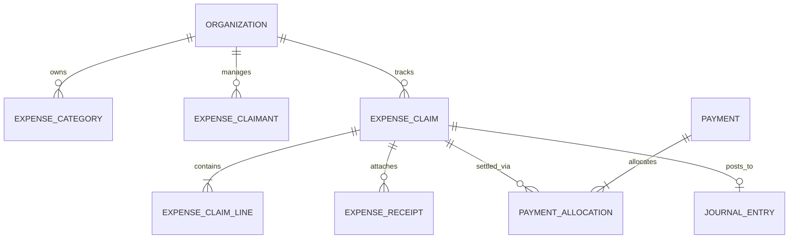
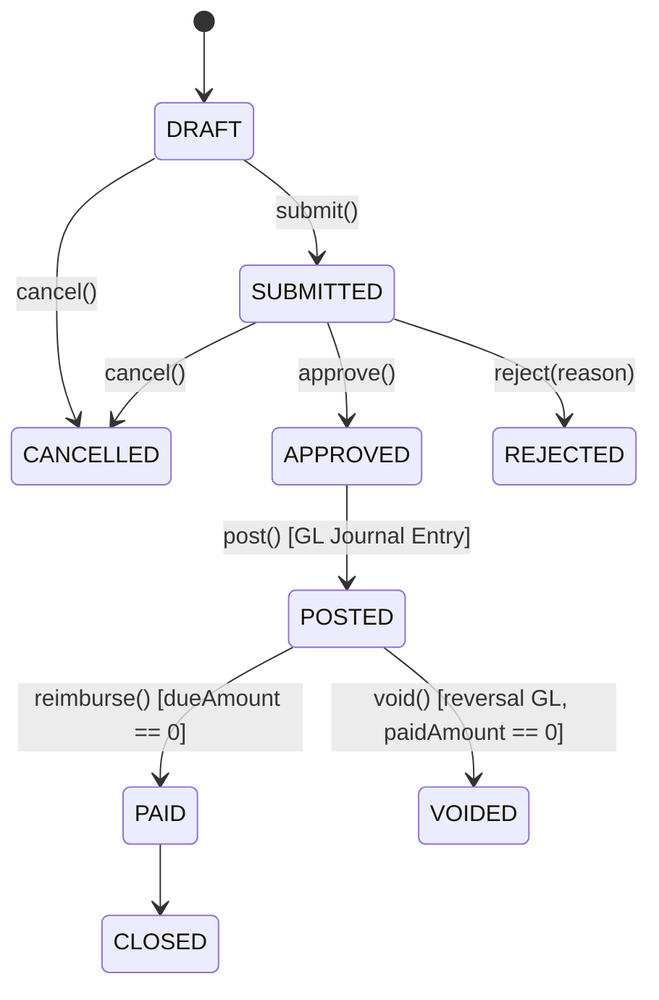

# Milestone M21 — Expense Management & Employee Reimbursements Foundation

## 1. Overview

Milestone **M21** delivers the production-grade, multi-tenant Expense Management and Employee Reimbursements module for the Universal Business Operations SaaS platform. It provides tenant-aware expense categories, employee/claimant profiles, draft expense claims with line-level tax calculation, structured approval workflows, automatic double-entry General Ledger postings, M15 payment reimbursements, receipt metadata tracking, and real-time expense reporting.

---

## 2. Core Entities & Architecture

### Models

- **`ExpenseCategory`**: Tenant classification with default GL account and default tax code.
- **`ExpenseClaimant`**: Lightweight claimant abstraction linking to system `User` and `PaymentAccount`.
- **`ExpenseClaim`**: Authoritative aggregate with multi-line totals, tax amounts, approval audit fields, and reimbursement balances.
- **`ExpenseClaimLine`**: Line-level breakdown with category, description, exact Decimal arithmetic (`quantity * unitPrice = subtotal`), tax rate, tax amount, and total.
- **`ExpenseReceipt`**: Receipt attachment metadata (`filename`, `mimeType`, `storageKey`, `fileSize`, `uploadedByUserId`).

---

## 3. Expense Claim Lifecycle State Machine

1. **`DRAFT`**: Created by user or employee. Lines and details can be edited.
2. **`SUBMITTED`**: Locked for editing. Submitted for management approval.
3. **`APPROVED`**: Approved by authorized manager. `approvedAmount` and `dueAmount` set.
4. **`POSTED`**: Transactionally posted to General Ledger (debiting expense accounts and input tax, crediting employee payable).
5. **`PAID`**: Fully settled via employee reimbursement payment(s).
6. **`REJECTED`**: Rejected with mandatory reason.
7. **`CANCELLED`**: Cancelled prior to posting.
8. **`VOIDED`**: Post-reversal state with compensating balanced journal entry.

---

## 4. Accounting & Tax Integration

### General Ledger Postings

When an expense claim is posted:

- **Debit**: Expense GL Account(s) (per line/category)
- **Debit**: Input Tax Account (`INPUT_TAX`, if `taxAmount > 0`)
- **Credit**: Employee Expense Payable Account (`EMPLOYEE_EXPENSE_PAYABLE`)

When a reimbursement payment is processed:

- **Debit**: Employee Expense Payable Account (`EMPLOYEE_EXPENSE_PAYABLE`)
- **Credit**: Cash / Bank Asset Account (`paymentAccount.accountingAccountId`)

### Tax Engine Integration (M20)

- Expense claim lines evaluate tax via M20 `TaxRatesService` based on date and tax code.
- Upon posting, input tax is recorded in the authoritative `tax_transactions` sub-ledger.

---

## 5. REST API Reference

| Method   | Endpoint                                       | Permission                       | Description                  |
| -------- | ---------------------------------------------- | -------------------------------- | ---------------------------- |
| `GET`    | `/api/v1/expenses/categories`                  | `expenses.categories.view`       | List expense categories      |
| `POST`   | `/api/v1/expenses/categories`                  | `expenses.categories.manage`     | Create expense category      |
| `GET`    | `/api/v1/expenses/categories/:id`              | `expenses.categories.view`       | Get category by ID           |
| `PATCH`  | `/api/v1/expenses/categories/:id`              | `expenses.categories.manage`     | Update category              |
| `DELETE` | `/api/v1/expenses/categories/:id`              | `expenses.categories.manage`     | Soft delete category         |
| `GET`    | `/api/v1/expenses/claimants`                   | `expenses.claimants.view`        | List claimant profiles       |
| `POST`   | `/api/v1/expenses/claimants`                   | `expenses.claimants.manage`      | Create claimant profile      |
| `GET`    | `/api/v1/expenses/claims`                      | `expenses.claims.view`           | List claims (filtered/paged) |
| `POST`   | `/api/v1/expenses/claims`                      | `expenses.claims.manage`         | Create expense claim         |
| `GET`    | `/api/v1/expenses/claims/:id`                  | `expenses.claims.view`           | Get claim by ID              |
| `POST`   | `/api/v1/expenses/claims/:id/submit`           | `expenses.claims.submit`         | Submit claim                 |
| `POST`   | `/api/v1/expenses/claims/:id/approve`          | `expenses.claims.approve`        | Approve claim                |
| `POST`   | `/api/v1/expenses/claims/:id/reject`           | `expenses.claims.approve`        | Reject claim with reason     |
| `POST`   | `/api/v1/expenses/claims/:id/cancel`           | `expenses.claims.cancel`         | Cancel claim                 |
| `POST`   | `/api/v1/expenses/claims/:id/post`             | `expenses.claims.post`           | Post claim to GL & Tax       |
| `POST`   | `/api/v1/expenses/claims/:id/void`             | `expenses.claims.void`           | Void posted claim            |
| `POST`   | `/api/v1/expenses/claims/:id/receipts`         | `expenses.claims.manage`         | Attach receipt metadata      |
| `GET`    | `/api/v1/expenses/reimbursements`              | `expenses.reimbursements.view`   | List reimbursements          |
| `POST`   | `/api/v1/expenses/claims/:id/reimburse`        | `expenses.reimbursements.manage` | Pay / reimburse claim        |
| `GET`    | `/api/v1/expenses/reports/summary`             | `expenses.reports.view`          | Executive summary report     |
| `GET`    | `/api/v1/expenses/reports/by-category`         | `expenses.reports.view`          | Category breakdown report    |
| `GET`    | `/api/v1/expenses/reports/reimbursement-aging` | `expenses.reports.view`          | Reimbursement aging report   |
| `GET`    | `/api/v1/expenses/reports/ledger`              | `expenses.reports.view`          | Detailed audit ledger        |
