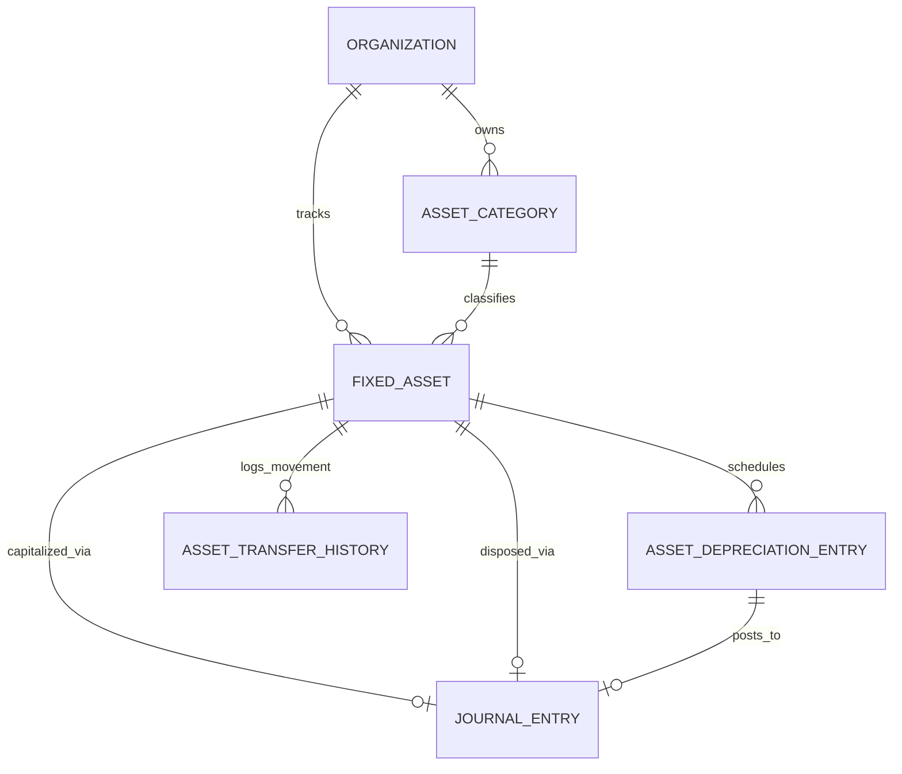
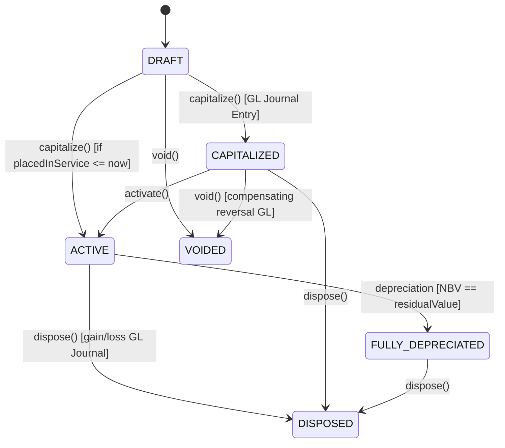

# Milestone M22 — Fixed Assets & Depreciation Accounting Foundation

## 1. Overview

Milestone **M22** establishes the production-grade, multi-tenant Fixed Asset Management and Depreciation Accounting foundation for the Universal Business Operations SaaS platform. It connects fixed asset acquisition, controlled capitalization workflows, straight-line depreciation calculations, automated period postings to General Ledger, asset disposal with gain/loss accounting, location movement tracking, and comprehensive audit and reconciliation reporting.

---

## 2. Core Architecture & Entity Models

### Models

- **`AssetCategory`**: Tenant classification defining default GL accounts (Asset, Accumulated Depreciation, Depreciation Expense), depreciation method, default useful life, and residual value percentage.
- **`FixedAsset`**: Core aggregate tracking lifecycle status, exact monetary values (`acquisitionCost`, `residualValue`, `accumulatedDepreciation`, `netBookValue`), source links (PO, Goods Receipt, Supplier Invoice), location, and disposal details.
- **`AssetDepreciationEntry`**: Monthly schedule entry recording `openingBookValue`, `depreciationAmount`, `accumulatedDepreciation`, `closingBookValue`, and linked `JournalEntry`.
- **`AssetTransferHistory`**: Historical movement log recording source location, destination location, transfer date, and user reason.

---

## 3. Asset Lifecycle State Machine

1. **`DRAFT`**: Created manually or from AP/Purchasing. Editable.
2. **`CAPITALIZED`**: Capitalization journal posted; depreciation schedule generated; waiting for service date.
3. **`ACTIVE`**: In service and actively depreciating each fiscal period.
4. **`FULLY_DEPRECIATED`**: Carrying net book value has reached residual value floor.
5. **`DISPOSED`**: Asset decommissioned, scrapped, or sold. GL gain/loss entry posted.
6. **`VOIDED`**: Post-reversal state with compensating journal entry (only if zero posted depreciation).

---

## 4. Accounting Integration & Double-Entry Workflows

### Capitalization Posting:

- **Debit**: Fixed Asset GL Account (`FIXED_ASSET` or category account)
- **Credit**: Accounts Payable / Acquisition Clearing Account (`ACCOUNTS_PAYABLE`)

### Monthly Depreciation Posting:

- **Debit**: Depreciation Expense Account (`DEPRECIATION_EXPENSE`)
- **Credit**: Accumulated Depreciation Account (`ACCUMULATED_DEPRECIATION`)

### Disposal Posting:

- **Debit**: Accumulated Depreciation (`accumulatedDepreciation`)
- **Debit**: Bank / Cash / Receivable (`disposalProceeds`, if $> 0$)
- **Debit**: Loss on Disposal (`ASSET_DISPOSAL_LOSS`, if $\text{proceeds} < \text{NBV}$)
- **Credit**: Gain on Disposal (`ASSET_DISPOSAL_GAIN`, if $\text{proceeds} > \text{NBV}$)
- **Credit**: Fixed Asset GL Account (`acquisitionCost`)

---

## 5. REST API Reference

| Method   | Endpoint                                    | Permission                   | Description                            |
| -------- | ------------------------------------------- | ---------------------------- | -------------------------------------- |
| `GET`    | `/api/v1/assets/categories`                 | `assets.categories.view`     | List asset categories                  |
| `POST`   | `/api/v1/assets/categories`                 | `assets.categories.manage`   | Create asset category                  |
| `GET`    | `/api/v1/assets/categories/:id`             | `assets.categories.view`     | Get category by ID                     |
| `PATCH`  | `/api/v1/assets/categories/:id`             | `assets.categories.manage`   | Update category                        |
| `DELETE` | `/api/v1/assets/categories/:id`             | `assets.categories.manage`   | Soft delete category                   |
| `GET`    | `/api/v1/assets`                            | `assets.view`                | List assets (paginated/filtered)       |
| `POST`   | `/api/v1/assets`                            | `assets.manage`              | Create draft asset                     |
| `GET`    | `/api/v1/assets/:id`                        | `assets.view`                | Get asset detail & schedule            |
| `PATCH`  | `/api/v1/assets/:id`                        | `assets.manage`              | Update draft asset                     |
| `POST`   | `/api/v1/assets/:id/capitalize`             | `assets.capitalize`          | Capitalize asset and generate schedule |
| `POST`   | `/api/v1/assets/:id/activate`               | `assets.manage`              | Activate capitalized asset             |
| `POST`   | `/api/v1/assets/:id/transfer`               | `assets.transfer`            | Transfer asset between locations       |
| `POST`   | `/api/v1/assets/:id/dispose`                | `assets.dispose`             | Dispose asset with gain/loss           |
| `POST`   | `/api/v1/assets/:id/void`                   | `assets.void`                | Void asset and reverse capitalization  |
| `GET`    | `/api/v1/assets/:id/depreciation-schedule`  | `assets.depreciation.view`   | View depreciation schedule             |
| `POST`   | `/api/v1/assets/depreciation-runs`          | `assets.depreciation.manage` | Execute period depreciation run        |
| `POST`   | `/api/v1/assets/depreciation/:entryId/post` | `assets.depreciation.manage` | Post individual entry                  |
| `GET`    | `/api/v1/assets/reports/register`           | `assets.reports.view`        | Fixed Asset Register report            |
| `GET`    | `/api/v1/assets/reports/depreciation`       | `assets.reports.view`        | Depreciation summary report            |
| `GET`    | `/api/v1/assets/reports/movements`          | `assets.reports.view`        | Asset movements report                 |
| `GET`    | `/api/v1/assets/reports/reconciliation`     | `assets.reports.view`        | Sub-ledger to GL reconciliation        |
