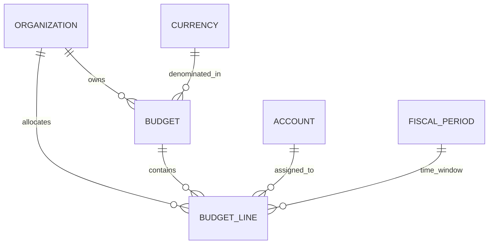
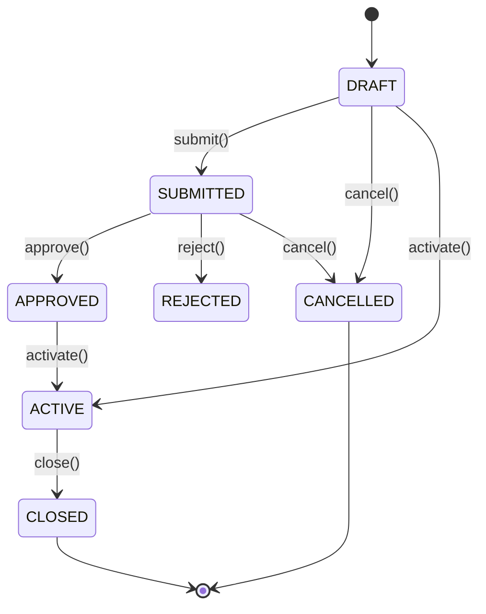

# Milestone M23 — Budgeting, Financial Planning & Budget Control Foundation

## 1. Overview

Milestone **M23** establishes the production-grade, multi-tenant Budgeting, Financial Planning, and Budget Control foundation for the Universal Business Operations SaaS platform. It provides structured annual and periodic budgeting, strict approval workflows, authoritative Budget vs. Actual comparisons directly from the M12 General Ledger, proactive budget availability checking with configurable control policies (`CHECK_ONLY`, `WARN`, `BLOCK`), threshold alert detection, and financial reporting integration.

---

## 2. Core Architecture & Entity Models



### Models

- **`Budget`**: Aggregate root representing a fiscal year budget plan. Encapsulates header metadata, currency, version, status, control policy (`CHECK_ONLY`, `WARN`, `BLOCK`), warning threshold %, total budget sum, and approval timestamps.
- **`BudgetLine`**: Granular periodized allocations referencing active tenant General Ledger accounts, budget categories (`SALES`, `COGS`, `OPERATING_EXPENSE`, `PAYROLL`, `MARKETING`, `ADMINISTRATION`, `CAPITAL_EXPENDITURE`, `OTHER`), period labels ("2026-01", "2026-Q1", "2026"), date ranges, and allocated Decimal amounts.

---

## 3. Budget Lifecycle State Machine



1. **`DRAFT`**: Editable state. Lines can be added, updated, or removed.
2. **`SUBMITTED`**: Locked for management review.
3. **`APPROVED`**: Formally authorized by management; ready for activation.
4. **`ACTIVE`**: Authoritative operational budget for the fiscal year; used for budget availability checks and vs-actual variance reporting.
5. **`CLOSED`**: Concluded fiscal year budget; immutable.
6. **`CANCELLED` / `REJECTED`**: Abandoned or rejected proposal.

---

## 4. Budget vs. Actual Engine

### Authoritative General Ledger Sourcing

- Actuals are computed strictly from posted `JournalLine` entries (`journalEntry.status == POSTED`). Draft and unposted journals are excluded.
- **Account Type Sourcing**:
  - `EXPENSE` / `ASSET`: $\text{Actual} = \sum(\text{Debit}) - \sum(\text{Credit})$
  - `REVENUE` / `LIABILITY` / `EQUITY`: $\text{Actual} = \sum(\text{Credit}) - \sum(\text{Debit})$
- **Variance & Utilization**:
  - $\text{Variance} = \text{Budget} - \text{Actual}$
  - $\text{Variance \%} = \frac{\text{Variance}}{\text{Budget}} \times 100$
  - $\text{Utilization \%} = \frac{\text{Actual}}{\text{Budget}} \times 100$
  - $\text{Remaining Amount} = \text{Budget} - \text{Actual}$

---

## 5. Budget Control Engine & Spending Verification

The `BudgetControlService` provides `checkBudgetAvailability(...)` for downstream modules (e.g., AP, Purchasing, Expenses):

```typescript
const result = await budgetControlService.checkBudgetAvailability(organizationId, {
  accountId: "acc-uuid",
  amount: 2500,
  date: "2026-08-15",
});
```

### Control Policies:

- **`CHECK_ONLY`**: Evaluates utilization metrics without enforcement.
- **`WARN`**: Returns `WARNING` result and emits `BUDGET_THRESHOLD_REACHED` / `BUDGET_EXCEEDED` if proposed expense crosses limits.
- **`BLOCK`**: Returns `EXCEEDED` result when proposed expense exceeds available balance, preventing unauthorized commitments.

---

## 6. REST API Reference

| Method   | Endpoint                                          | Permission                          | Description                               |
| -------- | ------------------------------------------------- | ----------------------------------- | ----------------------------------------- |
| `GET`    | `/api/v1/accounting/budgets`                      | `accounting.budgets.view`           | List budgets (paginated & filtered)       |
| `POST`   | `/api/v1/accounting/budgets`                      | `accounting.budgets.manage`         | Create new draft budget                   |
| `GET`    | `/api/v1/accounting/budgets/:id`                  | `accounting.budgets.view`           | Get budget details & lines                |
| `PATCH`  | `/api/v1/accounting/budgets/:id`                  | `accounting.budgets.manage`         | Update draft budget & lines               |
| `DELETE` | `/api/v1/accounting/budgets/:id`                  | `accounting.budgets.manage`         | Soft delete draft/cancelled budget        |
| `POST`   | `/api/v1/accounting/budgets/:id/submit`           | `accounting.budgets.submit`         | Submit budget for review                  |
| `POST`   | `/api/v1/accounting/budgets/:id/approve`          | `accounting.budgets.approve`        | Approve submitted budget                  |
| `POST`   | `/api/v1/accounting/budgets/:id/activate`         | `accounting.budgets.activate`       | Activate approved budget                  |
| `POST`   | `/api/v1/accounting/budgets/:id/close`            | `accounting.budgets.close`          | Close active budget                       |
| `POST`   | `/api/v1/accounting/budgets/:id/cancel`           | `accounting.budgets.cancel`         | Cancel budget                             |
| `POST`   | `/api/v1/accounting/budgets/:id/reject`           | `accounting.budgets.approve`        | Reject submitted budget                   |
| `GET`    | `/api/v1/accounting/budgets/:id/summary`          | `accounting.budgets.vs-actual.view` | Budget summary report                     |
| `GET`    | `/api/v1/accounting/budgets/:id/vs-actual`        | `accounting.budgets.vs-actual.view` | Budget vs Actual detailed report          |
| `GET`    | `/api/v1/accounting/budgets/:id/utilization`      | `accounting.budgets.vs-actual.view` | Budget utilization report                 |
| `GET`    | `/api/v1/accounting/budgets/:id/alerts`           | `accounting.budgets.alerts.view`    | Threshold alerts report                   |
| `GET`    | `/api/v1/accounting/budgets/:id/drill-down`       | `accounting.budgets.vs-actual.view` | Trace actuals to posted GL journals       |
| `GET`    | `/api/v1/accounting/budgets/:id/reports/account`  | `accounting.budgets.vs-actual.view` | Account-level budget report               |
| `GET`    | `/api/v1/accounting/budgets/:id/reports/category` | `accounting.budgets.vs-actual.view` | Category-level budget report              |
| `GET`    | `/api/v1/accounting/budgets/:id/reports/period`   | `accounting.budgets.vs-actual.view` | Period-level budget report                |
| `POST`   | `/api/v1/accounting/budget-control/check`         | `accounting.budgets.control.view`   | Pre-transaction budget availability check |
