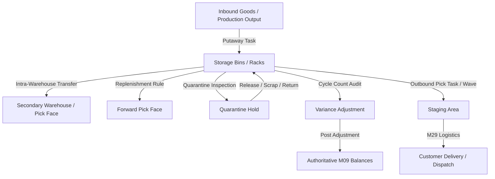

# Milestone M30: Warehouse Operations & Advanced Inventory Control Foundation

## 1. Executive Summary

Milestone M30 establishes the enterprise-grade warehouse operations and physical inventory execution layer for the Universal Business Operations SaaS platform. Operating on top of the M09 Inventory balances, M12 General Ledger, M19 Costing & COGS, M25 Manufacturing, M27 Procurement, M28 Sales Orders, and M29 Logistics infrastructure, M30 provides operational control without duplicating authoritative stock records.

## 2. Core Functional Pipelines

### 2.1 Spatial Topology & Taxonomy

- **Warehouse Zones (`WarehouseZone`)**: Divides facilities into `STORAGE`, `PICKING`, `BULK`, `COLD_STORAGE`, and `HAZMAT`.
- **Location Types (`WarehouseLocationType`)**: Classifies locations into `RECEIVING`, `STORAGE`, `PICK_FACE`, `STAGING`, `QUARANTINE`, `SCRAP`, `RETURN`, and `DAMAGED`.
- **Tenant Defaults (`WarehouseConfiguration`)**: Defines organization default receiving, staging, quarantine, scrap, and return locations.

### 2.2 Operational Task Engine

- **Warehouse Tasks (`WarehouseTask`)**: Generic operational task entity supporting `PUTAWAY`, `PICK`, `TRANSFER`, `COUNT`, and `REPLENISHMENT` with priority scheduling and user assignment.
- **Inbound Putaway (`PutawayTask`)**: Guides operators to relocate stock from receiving docks to assigned storage locations. Execution updates M09 balances via atomic `TRANSFER_OUT` and `TRANSFER_IN`.
- **Outbound Picking (`PickTask`, `PickWave`)**: Validates M09 sales reservations, directs pickers to storage bins, records partial or full picks, and stages inventory at `STAGING` dispatch points.

### 2.3 Physical Inventory Control

- **Cycle Counting (`CycleCount`, `CycleCountLine`)**: Snapshot-based counting supporting blind audits, variance calculation ($\text{counted} - \text{system}$), review approvals, and posting through M09 `ADJUSTMENT_IN`/`ADJUSTMENT_OUT` with M19 Costing integration.
- **Quarantine Management (`QuarantineRecord`)**: Segregates suspect lots from Available-to-Promise stock with lifecycle transitions (`QUARANTINED`, `UNDER_INSPECTION`, `RELEASED`, `HELD`, `SCRAPPED`, `RETURNED`).
- **Dynamic Bin Replenishment (`ReplenishmentRule`, `ReplenishmentTask`)**: Evaluates forward pick face levels against min/max thresholds and generates relocation tasks from bulk storage.

## 3. Database Invariants

M30 enforces database invariants 149 through 168:

- Invariant 149: Unique zone code per location within tenant organization.
- Invariants 150–154: Putaway validation, positive quantities, and atomic movement transactions.
- Invariants 155–158: Pick quantity bounds ($0 \le \text{picked} \le \text{requested}$) and wave aggregation.
- Invariants 159–162: Transfer location uniqueness, positive quantities, and 2-step approval lifecycle.
- Invariants 163–164: Cycle count variance calculation and reviewed posting gate.
- Invariants 165–166: Quarantine stock quantity bounds and finite state machine.
- Invariants 167–168: Replenishment min/max constraints and tenant configuration location ownership.

## 4. API Endpoints Reference

- `GET/POST /api/v1/warehouse/zones`
- `GET /api/v1/warehouse/stock`
- `GET/POST /api/v1/warehouse/stock/quarantine`
- `GET/POST /api/v1/warehouse/tasks`
- `GET/POST /api/v1/warehouse/putaway`
- `GET/POST /api/v1/warehouse/picks`
- `GET/POST /api/v1/warehouse/waves`
- `GET/POST /api/v1/warehouse/transfers`
- `GET/POST /api/v1/warehouse/counts`
- `GET/POST /api/v1/warehouse/replenishment`
- `GET/PUT /api/v1/warehouse/configuration`
- `GET /api/v1/warehouse/reports/*` (9 reports: accuracy rate, stock by location, occupancy, task performance, count variances, quarantine aging, replenishment history, transfer volume, picking velocity)
