# Milestone M33 — Financial Reporting, Period Close & Management Accounting Foundation

## 1. Mission & Domain Boundary

Milestone **M33 — Financial Reporting, Period Close & Management Accounting Foundation** establishes an enterprise-grade financial reporting, continuous subledger-to-GL reconciliation, and deterministic accounting period closing engine for the Universal Business Operations SaaS platform.

M33 adheres strictly to the single authoritative source principle:

- **No Duplicate Accounting Engine**: It does not recreate journal storage or general ledger tables.
- **Authoritative Aggregation**: All financial reports (Trial Balance, General Ledger Explorer, Balance Sheet, Profit & Loss, Cash Flow) aggregate directly from posted `JournalEntry` and `JournalLine` records created by M12 General Ledger, M13 AP, M14 AR, M15 Payments, M18 Credits/Debits/Refunds, M19 COGS/Inventory Valuation, M20 Tax, M21 Expenses, M22 Fixed Assets, M23 Budgeting, M24 Payroll, M25 Manufacturing, M27 Procurement, M28 Sales Orders, and M32 Returns.
- **Period Close & Immutability Locks**: Period close enforcement is integrated at the narrowest shared authoritative boundary (`AccountingPostingService.post()`). Any financial mutation into a closed or closing period is rejected.

---

## 2. Architecture & Data Model

```mermaid
erDiagram
    FiscalPeriod ||--o{ PeriodCloseRun : "initiates"
    FiscalPeriod ||--o{ FinancialReportSnapshot : "historical snapshots"
    FiscalPeriod ||--o{ JournalEntry : "groups postings"
    PeriodCloseRun ||--o{ PeriodCloseCheck : "contains diagnostic results"

    FiscalPeriod {
        uuid id PK
        uuid organization_id FK
        string name
        int fiscal_year
        int period_number
        date start_date
        date end_date
        FiscalPeriodStatus status "OPEN | CLOSING | CLOSED"
        timestamp closed_at
        uuid closed_by_user_id
        timestamp reopened_at
        uuid reopened_by_user_id
        string reopen_reason
    }

    PeriodCloseRun {
        uuid id PK
        uuid organization_id FK
        uuid fiscal_period_id FK
        uuid initiated_by_user_id
        PeriodCloseRunStatus status "PENDING | RUNNING | PASSED | FAILED | CLOSED | CANCELLED"
        timestamp started_at
        timestamp completed_at
        string validation_summary
        json failure_information
    }

    PeriodCloseCheck {
        uuid id PK
        uuid organization_id FK
        uuid close_run_id FK
        PeriodCloseCheckType check_type
        PeriodCloseCheckStatus status "PASSED | WARNING | FAILED | NOT_APPLICABLE"
        string severity "BLOCKING | WARNING | INFO"
        string message
        int affected_count
        json metadata
    }

    FinancialReportSnapshot {
        uuid id PK
        uuid organization_id FK
        uuid fiscal_period_id FK
        ReportSnapshotType report_type
        uuid generated_by_user_id
        timestamp generated_at
        json report_data
        string checksum
        boolean is_immutable
    }
```

---

## 3. Deterministic 11-Check Period Close Engine

Before any accounting period can transition to `CLOSED`, `PeriodCloseEngineService` evaluates 11 automated validation checks:

| #   | Check Type                   | Scope & Rule                                                           | Severity |
| --- | ---------------------------- | ---------------------------------------------------------------------- | -------- |
| 1   | `TRIAL_BALANCE`              | Debits equal Credits ($\sum Debit = \sum Credit$)                      | BLOCKING |
| 2   | `UNBALANCED_JOURNALS`        | Detects unbalanced draft journal entries                               | BLOCKING |
| 3   | `UNPOSTED_TRANSACTIONS`      | Verifies draft journals, unposted supplier invoices, unposted payments | BLOCKING |
| 4   | `AP_RECONCILIATION`          | AP subledger outstanding sum equals GL Accounts Payable balance        | BLOCKING |
| 5   | `AR_RECONCILIATION`          | AR subledger outstanding sum equals GL Accounts Receivable balance     | BLOCKING |
| 6   | `INVENTORY_RECONCILIATION`   | Inventory valuation cost layers sum equals GL Inventory Assets         | BLOCKING |
| 7   | `TAX_RECONCILIATION`         | Tax transactions match GL Tax liability/asset entries                  | BLOCKING |
| 8   | `PAYROLL_RECONCILIATION`     | Payroll runs within the period are processed and posted                | WARNING  |
| 9   | `FIXED_ASSET_RECONCILIATION` | Depreciation journal entries exist for active capitalized fixed assets | BLOCKING |
| 10  | `COGS_RECONCILIATION`        | COGS subledger records match GL Cost of Goods Sold expense accounts    | BLOCKING |
| 11  | `SUBLEDGER_RECONCILIATION`   | Aggregate reconciliation health across all operational subledgers      | BLOCKING |

---

## 4. API & Permissions

### Endpoints

- `GET /api/v1/accounting/reports/trial-balance` (`accounting.reports.trial-balance.view`)
- `GET /api/v1/accounting/reports/general-ledger` (`accounting.reports.general-ledger.view`)
- `GET /api/v1/accounting/reports/balance-sheet` (`accounting.reports.balance-sheet.view`)
- `GET /api/v1/accounting/reports/profit-loss` (`accounting.reports.profit-loss.view`)
- `GET /api/v1/accounting/reports/cash-flow` (`accounting.reports.cash-flow.view`)
- `GET /api/v1/accounting/reports/financial-kpis` (`accounting.reports.kpis.view`)
- `GET /api/v1/accounting/reports/reconciliation` (`accounting.reports.reconciliation.view`)
- `GET /api/v1/accounting/reports/budget-vs-actual` (`accounting.reports.view`)
- `POST /api/v1/accounting/reports/snapshots` (`accounting.reports.view`)
- `GET /api/v1/accounting/reports/snapshots` (`accounting.reports.view`)
- `GET /api/v1/accounting/fiscal-periods` (`accounting.periods.view`)
- `POST /api/v1/accounting/fiscal-periods` (`accounting.periods.create`)
- `POST /api/v1/accounting/fiscal-periods/:id/start-close` (`accounting.periods.close`)
- `POST /api/v1/accounting/fiscal-periods/:id/validate-close` (`accounting.periods.close`)
- `POST /api/v1/accounting/fiscal-periods/:id/close` (`accounting.periods.close`)
- `POST /api/v1/accounting/fiscal-periods/:id/reopen` (`accounting.periods.reopen`)

---

## 5. Web Experience

Located at `/accounting/reports`:

- **Dashboard & KPIs**: Real-time revenue, gross margin %, net profit %, working capital, current ratio, and quick ratio.
- **Trial Balance**: Complete debit/credit columns with instant balance validation banner.
- **General Ledger Explorer**: Running balance calculation with drilldown.
- **Profit & Loss Statement**: Multi-step revenue, COGS, operating expense, and net income view.
- **Balance Sheet**: Assets = Liabilities + Equity invariant check.
- **Cash Flow**: Operating, Investing, and Financing cash flow statement.
- **Subledger Reconciliation**: Live variance diagnostic matrix across AP, AR, Inventory, Tax, Assets, and COGS.
- **Period Close Management**: Fiscal calendar management, pre-close diagnostic runner, and audited period reopen modal.
