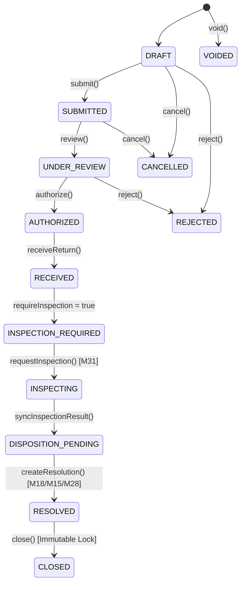

# Milestone M32 — Returns, Reverse Logistics & RMA Foundation

## Executive Summary

Milestone M32 establishes an enterprise-grade, multi-tenant reverse-logistics and Return Merchandise Authorization (RMA) orchestration domain within the Universal Business Operations SaaS platform.

M32 acts as an orchestration engine across prior foundational modules rather than duplicating core ledger, inventory, or physical storage records. It integrates deeply with:

- **M09 & M30**: Inventory & Warehouse Operations (auto-quarantine routing, quarantine locations, restock receiving).
- **M12, M13, M14, M15, M18, M19**: Accounting, AP, AR, Payments, Credit/Debit Notes, and Costing (automatic issuance of Customer Credit Notes, monetary Refunds, Supplier Debit Notes, and COGS reversals).
- **M25 & M27**: Manufacturing & Procurement (rework routing, supplier return orchestration).
- **M28 & M29**: Sales Orders & Shipment Logistics (delivered quantity return eligibility validation, replacement sales fulfillment, forward and reverse shipment tracking).
- **M31**: Quality Management & Inspection (inspection lots, characteristic testing, and decision gating).

---

## 1. Domain Entities & Database Schema

### 1.1 New Enums

- `ReturnType`: `CUSTOMER_RETURN`, `SUPPLIER_RETURN`, `INTERNAL_RETURN`, `WARRANTY_RETURN`, `REPLACEMENT_RETURN`
- `ReturnStatus`: `DRAFT`, `SUBMITTED`, `UNDER_REVIEW`, `AUTHORIZED`, `AWAITING_RETURN`, `IN_TRANSIT`, `RECEIVED`, `INSPECTION_REQUIRED`, `INSPECTING`, `DISPOSITION_PENDING`, `RESOLVED`, `CLOSED`, `REJECTED`, `CANCELLED`, `VOIDED`
- `ReturnLineStatus`: `PENDING`, `AUTHORIZED`, `REJECTED`, `IN_TRANSIT`, `RECEIVED`, `INSPECTED`, `DISPOSITIONED`, `RESOLVED`, `CANCELLED`
- `ReturnDispositionType`: `RESTOCK`, `REPAIR`, `REWORK`, `REPLACE`, `SCRAP`, `RETURN_TO_SUPPLIER`, `REJECT_RETURN`, `NO_ACTION`
- `ReturnResolutionType`: `NONE`, `CREDIT_NOTE`, `REFUND`, `DEBIT_NOTE`, `REPLACEMENT`, `PARTIAL_CREDIT`, `PARTIAL_REFUND`

### 1.2 Database Models

- `ReturnReason`: Configurable reason codes with inspection mandates and default dispositions.
- `ReturnPolicy`: Tenant-level configuration defining return window days, auto-quarantine rules, partial return allowances, and replacement caps.
- `ReturnRequest`: RMA header keyed by `(organizationId, returnNumber)`.
- `ReturnRequestLine`: Return lines tracking progressive quantities (`requested`, `authorized`, `received`, `inspected`, `accepted`, `rejected`, `replacement`, `financialResolution`).
- `ReturnDispositionRecord`: Immutable audit records of physical material disposition actions.
- `ReturnResolution`: Financial and fulfillment resolution records linking to M18 Credit Notes, M18/M15 Refunds, M18 Debit Notes, or replacement Sales Orders.

---

## 2. Core Workflow & State Machine

---

## 3. RBAC Permissions

| Permission                   | Description                                          | Assigned Roles |
| ---------------------------- | ---------------------------------------------------- | -------------- |
| `returns.view`               | View return requests and lines                       | ADMIN, VIEWER  |
| `returns.manage`             | Create, update RMA headers and lines                 | ADMIN          |
| `returns.submit`             | Submit return requests for review                    | ADMIN          |
| `returns.review`             | Transition RMA into review status                    | ADMIN          |
| `returns.authorize`          | Authorize return lines and assign quantities         | ADMIN          |
| `returns.receive`            | Post warehouse receipt to quarantine/return location | ADMIN          |
| `returns.inspection.request` | Request and sync M31 quality inspection lots         | ADMIN          |
| `returns.disposition.view`   | View executed material dispositions                  | ADMIN, VIEWER  |
| `returns.disposition.manage` | Execute material disposition actions                 | ADMIN          |
| `returns.credit-note`        | Issue customer credit note resolution                | ADMIN          |
| `returns.refund`             | Issue monetary customer refund resolution            | ADMIN          |
| `returns.debit-note`         | Issue supplier debit note resolution                 | ADMIN          |
| `returns.replace`            | Issue replacement fulfillment order                  | ADMIN          |
| `returns.reject`             | Reject return requests                               | ADMIN          |
| `returns.cancel`             | Cancel return requests                               | ADMIN          |
| `returns.void`               | Void return requests                                 | ADMIN          |
| `returns.close`              | Close RMA and engage immutability lock               | ADMIN          |
| `returns.reports.view`       | Access intelligence and audit reports                | ADMIN, VIEWER  |
| `returns.policy.manage`      | Configure tenant return rules & policy               | ADMIN          |

---

## 4. API Specification

| Endpoint                                 | Method | Permission                   | Description                                                |
| ---------------------------------------- | ------ | ---------------------------- | ---------------------------------------------------------- |
| `/api/v1/returns`                        | GET    | `returns.view`               | List return requests with query filters                    |
| `/api/v1/returns`                        | POST   | `returns.manage`             | Create a new Return Request (RMA)                          |
| `/api/v1/returns/:id`                    | GET    | `returns.view`               | Get RMA details with lines, lot, dispositions, resolutions |
| `/api/v1/returns/:id`                    | PATCH  | `returns.manage`             | Update editable fields on open RMA                         |
| `/api/v1/returns/:id/submit`             | POST   | `returns.submit`             | Transition RMA from DRAFT to SUBMITTED                     |
| `/api/v1/returns/:id/review`             | POST   | `returns.review`             | Transition RMA to UNDER_REVIEW                             |
| `/api/v1/returns/:id/authorize`          | POST   | `returns.authorize`          | Authorize return and assign line quantities                |
| `/api/v1/returns/:id/reject`             | POST   | `returns.reject`             | Reject return request with reason                          |
| `/api/v1/returns/:id/cancel`             | POST   | `returns.cancel`             | Cancel return request                                      |
| `/api/v1/returns/:id/void`               | POST   | `returns.void`               | Void return request                                        |
| `/api/v1/returns/:id/close`              | POST   | `returns.close`              | Close RMA and lock record immutably                        |
| `/api/v1/returns/:id/receive`            | POST   | `returns.receive`            | Post physical receipt to warehouse/quarantine location     |
| `/api/v1/returns/:id/request-inspection` | POST   | `returns.inspection.request` | Create M31 QualityInspectionLot for returned goods         |
| `/api/v1/returns/:id/sync-inspection`    | POST   | `returns.inspection.request` | Sync M31 inspection lot decision into RMA lines            |
| `/api/v1/returns/:id/dispositions`       | GET    | `returns.disposition.view`   | List executed disposition records                          |
| `/api/v1/returns/:id/dispositions`       | POST   | `returns.disposition.manage` | Record disposition (RESTOCK, SCRAP, REWORK, etc.)          |
| `/api/v1/returns/:id/resolutions`        | GET    | `returns.view`               | List financial and fulfillment resolutions                 |
| `/api/v1/returns/:id/credit-note`        | POST   | `returns.credit-note`        | Create M18 Customer Credit Note resolution                 |
| `/api/v1/returns/:id/refund`             | POST   | `returns.refund`             | Create M18/M15 Customer Refund resolution                  |
| `/api/v1/returns/:id/debit-note`         | POST   | `returns.debit-note`         | Create M18 Supplier Debit Note resolution                  |
| `/api/v1/returns/:id/replacement`        | POST   | `returns.replace`            | Create M28 Replacement Sales Order resolution              |
| `/api/v1/returns/reasons`                | GET    | `returns.view`               | List return reason codes                                   |
| `/api/v1/returns/reasons`                | POST   | `returns.manage`             | Create new return reason code                              |
| `/api/v1/returns/policy`                 | GET    | `returns.view`               | Get tenant return policy configuration                     |
| `/api/v1/returns/policy`                 | PATCH  | `returns.policy.manage`      | Update tenant return policy configuration                  |
| `/api/v1/returns/reports/:type`          | GET    | `returns.reports.view`       | Query 9 intelligence & analytics reports                   |

---

## 5. Intelligence Reports

1. **Return Summary Report**: RMA volume, stage breakdown, and overall financial value.
2. **Customer Returns Report**: Granular customer return lines, source orders, shipments, and reasons.
3. **Supplier Returns Report**: Vendor returns mapped to purchase orders and goods receipt notes.
4. **Return Reason Analysis**: Frequency, volume, and percentage impact per defect/reason code.
5. **Disposition Analysis**: Volume distribution across RESTOCK, SCRAP, REWORK, REPAIR, REPLACE, and RETURN_TO_SUPPLIER.
6. **Financial Impact Report**: Credit notes issued, refunds paid, vendor debit notes recovered, and scrap write-offs.
7. **RMA Aging Report**: Aging buckets (<1 day, 1-7 days, 8-15 days, 16-30 days, 31-60 days, 60+ days).
8. **Quality-Linked Returns Report**: Returns linked directly to M31 inspection lots and NCRs.
9. **Return Trend Analysis**: Monthly aggregate progression of return volume and value.

---

## 6. Verification Summary

- **Database Invariants**: Invariants 189 through 208 implemented and 100% passing in `apps/api/src/prisma/database-invariants.spec.ts`.
- **Unit & Integration Test Suites**: 13 dedicated test suites in `apps/api/src/returns/` passing with 100% coverage.
- **Full Platform Test Suite**: 214 test suites, 1,175 unit and integration tests passing cleanly across the platform.
- **Frontend Verification**: TypeScript typecheck and ESLint passed with 0 errors across `apps/web`.
