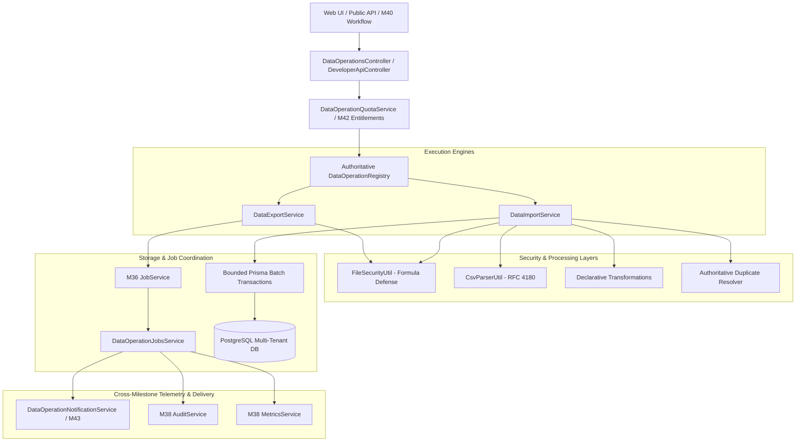

# Data Operations Platform Architecture Overview

## Executive Summary

Milestone M46 establishes the centralized **Data Export, Import & Bulk Operations Platform** for the Universal Business Operations SaaS. Under the governing philosophy:

> **"One Bulk Data Engine → Many Domain Operations"**

M46 replaces domain-level CSV/import/export fragmentation with a single, highly resilient, auditable platform foundation. It unifies bulk operations across CRM, Inventory, Sales, Catalog, Finance, and other domain modules with strict tenant boundary enforcement, declarative schema validation, formula injection protection, dry-run previews, resumable idempotency, bounded concurrency, and cross-milestone integrations (M36 background jobs, M37 RBAC, M38 observability, M40 workflow actions, M41 public API contracts, M42 quotas, and M43 omnichannel notifications).

---

## Core System Architecture

---

## Key Platform Capabilities

1. **Authoritative Operation Registry**: In-memory singleton declaring canonical export and import operations (`crm.customer.export`, `inventory.item.import`, etc.), authoritative field allowlists, restricted field boundaries, identity keys, and transformation pipelines.
2. **Streaming & Chunked Export Pipeline**: Deterministic record chunking (500 rows per chunk) with strict database tenant predicate scoping (`where.organizationId = organizationId`), restricted field permission gating, and spreadsheet formula injection sanitization (`FileSecurityUtil`).
3. **Dry-Run Import Preview**: Full verification of format, schema, column mapping, transformations, and duplicate conflicts without executing persistent database writes.
4. **Resumable Idempotent Ingestion**: Chunked batch commits (250 rows default) tracked via `DataOperationBatch` state. Retries skip committed batches, guaranteeing zero duplicate mutations.
5. **Robust State Machine & Cancellation**: Strictly managed job lifecycle (`PENDING` → `QUEUED` / `PREVIEWING` → `PROCESSING` → `COMPLETED` / `FAILED` / `CANCELLED`) with transactional boundaries on cancellation.
6. **Cross-Milestone Foundational Integration**:
   - **M36 Jobs**: Asynchronous execution for high-volume jobs with retry and backoff.
   - **M37 RBAC**: Fine-grained permission checks for operations and restricted fields.
   - **M38 Telemetry & Audit**: Structured audit records with sanitized metadata.
   - **M40 Workflows**: Built-in actions (`start_export`, `start_import`) for workflow orchestration.
   - **M41 Public API**: Full REST contract parity under `/api/v1/data-operations/...`.
   - **M42 Entitlements**: Monthly quota and concurrent job limit enforcement.
   - **M43 Notifications**: Omnichannel delivery for job completion and failure alerts.
