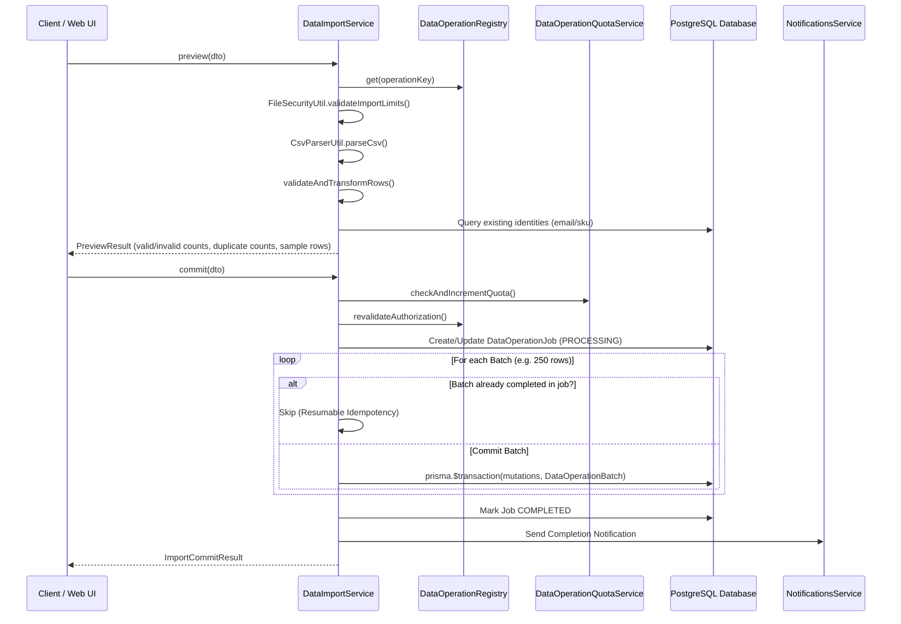

# Centralized Bulk Data Import Pipeline

## Overview

The `DataImportService` (`apps/api/src/data-operations/services/data-import.service.ts`) provides unified file ingestion, schema validation, transformation, dry-run simulation, and transactional commit execution across all registered entities.

---

## Import Execution Lifecycle

---

## Declarative Transformations Engine

Transformations are strictly declarative (INV-537). Dynamic JavaScript `eval()` or arbitrary expressions are strictly disallowed (INV-534). Registered transformation functions include:

- `trim`: Strips leading and trailing whitespace.
- `toLowerCase`: Lowercases string values (e.g. for standardizing email addresses).
- `toUpperCase`: Uppercases string values (e.g. for ISO codes, country codes).
- `toCents`: Multiplies decimal dollars by 100 and rounds to minor-unit integer cents (`19.99` → `1999`).
- `toInteger`: Parses integer strings safely.
- `normalizePhone`: Removes non-digit characters except leading `+`.
- `booleanString`: Converts `'true' | '1' | 'yes'` to boolean `true`.

---

## Import Modes and Duplicate Resolution

The engine supports three strictly non-destructive import modes:

1. `CREATE_ONLY`: Inserts new records. If an identity conflict is found:
   - Strategy `FAIL`: Entire batch fails with validation conflict error.
   - Strategy `SKIP`: Row is skipped and counted in `skippedRows`.
2. `UPDATE_ONLY`: Updates existing records matching identity fields. If record does not exist:
   - Strategy `FAIL`: Row marked as invalid.
   - Strategy `SKIP`: Row skipped.
3. `UPSERT`: Updates existing records if identity matches; inserts new record otherwise.

Destructive `DELETE` and `REPLACE` modes are completely excluded from the engine.
