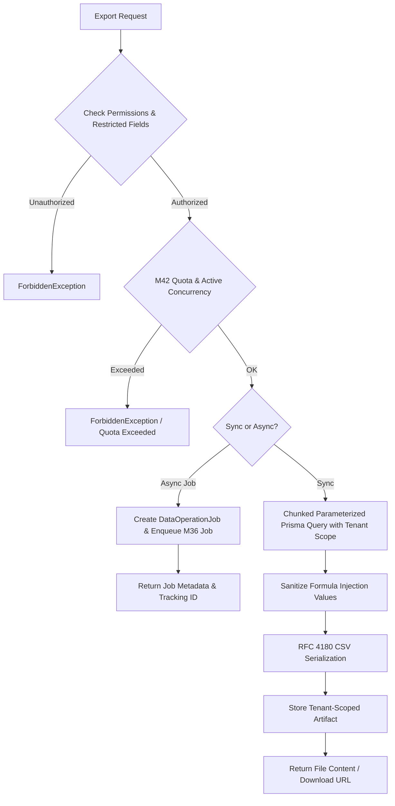

# Centralized Data Export Pipeline

## Overview

The `DataExportService` (`apps/api/src/data-operations/services/data-export.service.ts`) executes secure, streaming, tenant-isolated data extractions. It supports synchronous direct downloads (for datasets ≤ 5,000 rows) and asynchronous background processing (via M36 `JobService` for high-volume datasets up to 50,000 rows).

---

## Architectural Workflow



---

## Technical Specifications

### Deterministic Chunking & Bounded Memory

To prevent Node.js heap memory exhaustion during large query processing:

- Queries execute in chunks of `500` rows using cursor/offset pagination ordered deterministically by primary key (`id ASC`).
- Rows are serialized incrementally into the output buffer.
- Synchronous exports are capped at 10,000 rows.
- Asynchronous exports are capped at 50,000 rows.

### Formula Injection Protection (CSV Injection)

Every exported field value is examined by `FileSecurityUtil.sanitizeCsvValue`:

```typescript
if (typeof val === "string" && /^[=+\-@\t\r]/.test(val)) {
  return `'${val}`;
}
```

This prepends a single quote to any cell value that begins with `=`, `+`, `-`, `@`, `\t`, or `\r`, neutralizing malicious spreadsheet commands when the resulting CSV is opened in Microsoft Excel, LibreOffice, or Google Sheets.

### Tenant Isolation

The database query builder enforces hard-coded multi-tenant isolation:

```typescript
where: {
  organizationId,
  ...filterWhere,
}
```

This guarantees that records outside the caller's organization cannot be queried or returned (INV-528).
